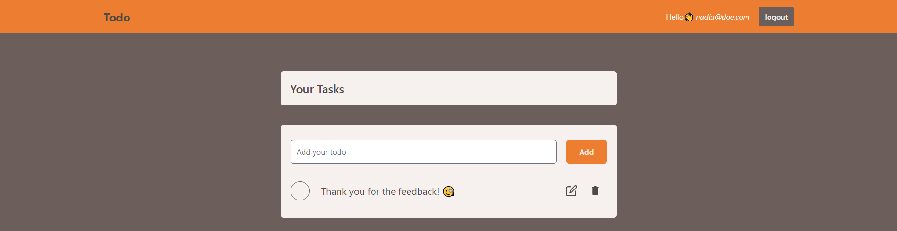

  

<a href="https://main--illustrious-platypus-807930.netlify.app/#/auth"> <h3 align="center">mern-app</h3> </a>

---

 Crud full stack app 🧐
      

## 📝 Table of Contents

- [About](#about)
- [Built Using](#built_using)
- [Backend tree](#backend_tree)

## 🧐 About 

Mainly, I wanted to practice the backend stack, which includes <strong>Express</strong> and <strong>Node.js</strong> , along with a <strong>NoSql</strong> database, in this case, mongoDB.

Additionally, I practiced new React-Router features, such as actions and loaders.

## ⛏️ Built Using 

- [MongoDB](https://www.mongodb.com/) - Database
- [Express](https://expressjs.com/) - Server Framework
- [React](https://react.dev/) - Web Library
- [NodeJs](https://nodejs.org/en/) - Server Environment
- [Tailwind](https://tailwindcss.com/) - CSS Framework

## 🌲 Backend Tree 

<pre>
mern-app/
├─ index.html .................. 
├─ package-lock.json ........... 
├─ package.json ................ 
├─ README.md ................... 
├─ backend/ .................... 
│  ├─ nodemon.json ............. 
│  ├─ package-lock.json ........ 
│  ├─ package.json ............. 
│  ├─ tsconfig.json ............ 
│  └─ src/ ..................... 
│     ├─ server.ts ............. 
│     ├─ controllers/ .......... 
│     │  ├─ auth.ts ............ 
│     │  ├─ check-auth.ts ...... 
│     │  └─ todo.ts ............ 
│     ├─ middleware/ ........... 
│     │  ├─ error-handler.ts ... 
│     │  └─ is-auth.ts ......... 
│     ├─ models/ ............... 
│     │  ├─ custom-error.ts .... 
│     │  ├─ todo.ts ............ 
│     │  └─ user.ts ............ 
│     ├─ routes/ ............... 
│     │  ├─ auth.ts ............ 
│     │  └─ todo.ts ............ 
│     └─ utils/ ................ 
│        └─ utils.ts ........... 
└─ frontend/ ...
</pre>

